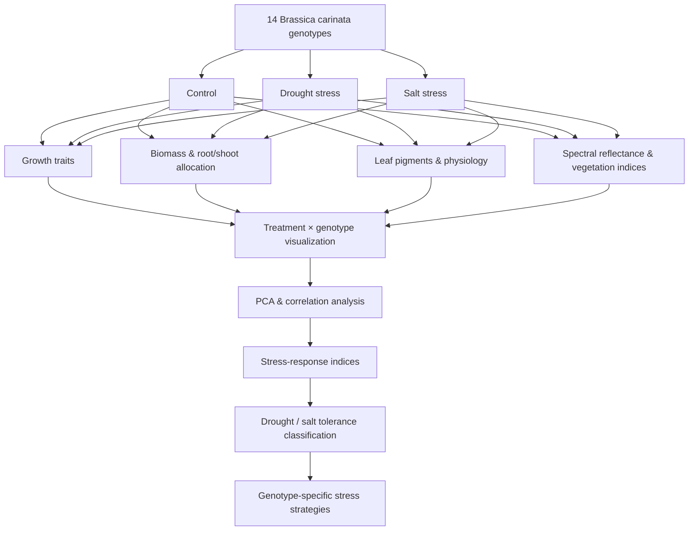

# Drought and Salt Stress Responses in *Brassica carinata*

[](https://doi.org/10.1016/j.indcrop.2025.121648)
[](https://doi.org/10.1016/j.indcrop.2025.121648)
[](https://www.sciencedirect.com/science/article/pii/S092666902501194X)
[](#repository-workflows)
[](#analytical-workflow)

## Published study

**Vennam, R. R., Chinthalapudi, D. P. M., Shrestha, A., Bheemanahalli, R., Seepaul, R., Gao, W., & Reddy, K. R. (2025).**  
**Exploring the effects of drought and salt stress on physiology, leaf reflectance, and growth dynamics of *Brassica carinata*.**  
*Industrial Crops and Products*, **235**, 121648.  
**DOI:** [10.1016/j.indcrop.2025.121648](https://doi.org/10.1016/j.indcrop.2025.121648)  
**Full article:** [ScienceDirect](https://www.sciencedirect.com/science/article/pii/S092666902501194X)

This repository contains the **R-based statistical analysis, visualization, principal component analysis (PCA), and stress-response index workflows** associated with this published study.

---

## Study overview

*Brassica carinata* A. Braun is an emerging oilseed crop with potential as a renewable feedstock for biofuels, including sustainable aviation fuel. However, its early-season responses to **drought and salinity** are still important constraints for genotype selection and production in stress-prone environments.

This study evaluated **14 advanced carinata genotypes** under three environmental conditions:

- **Control**
- **Drought stress**
- **Salt stress**

Plants were evaluated three weeks after stress initiation for a broad set of traits spanning:

- plant growth;
- biomass production and allocation;
- leaf pigments;
- gas exchange;
- chlorophyll fluorescence;
- canopy temperature;
- spectral reflectance and vegetation indices; and
- integrated drought and salt response indices.

The major conclusion was that **drought caused substantially greater early-season growth and physiological disruption than salt stress**, while genotypes differed in how they allocated resources and regulated water use under stress.

---

## Experimental design

| Component | Description |
|---|---|
| Species | *Brassica carinata* A. Braun |
| Genotypes | 14 advanced genotypes |
| Treatments | Control, drought, salt stress |
| Replication | 4 biological replicates per genotype × treatment |
| Experimental units | 168 plants used for the study |
| Evaluation time | 21 days after stress treatment |
| Experimental setting | Controlled greenhouse / mini-hoop environment |

The 14 genotypes included hybrids, inbred lines, double hybrids, and a commercial check. Genotypes displayed substantial variation in both drought and salt tolerance, allowing the study to identify contrasting resource-use strategies.

---

## Trait categories

The repository analysis organizes traits into biologically meaningful groups.

### 🌱 Growth

- Plant height
- Leaf number
- Leaf area

### ⚖️ Biomass and allocation

- Shoot dry weight
- Root dry weight
- Total biomass
- Root-to-shoot ratio

### 🍃 Pigments

- Chlorophyll
- Flavonoids
- Anthocyanins
- Nitrogen Balance Index (NBI)

### 🌡️ Physiology

- Stomatal conductance (`gsw`)
- Transpiration (`E_apparent`)
- Quantum efficiency of photosystem II (`PhiPS2`)
- Electron transport rate (`ETR`)
- Canopy temperature (`CT`)
- Canopy temperature depression (`CTD`)

### 🛰️ Proximal sensing

The published study additionally evaluated spectral reflectance-derived vegetation indices as non-destructive indicators of stress response, including indices associated with canopy greenness and physiological status.

---

## Analytical workflow



---

## Statistical analysis represented in this repository

The R workflows include:

| Analysis | Purpose |
|---|---|
| Treatment-level boxplots | Compare control, drought, and salt responses |
| Genotype × treatment plots | Visualize genotype-specific stress responses |
| Trait-category panels | Summarize growth, biomass, pigment, and physiological traits |
| Radar plots | Compare multivariate genotype response profiles |
| Correlation analysis | Examine relationships among stress-response traits |
| Principal component analysis | Identify dominant multivariate stress-response axes |
| PCA variable contribution | Determine which traits drive stress separation |
| PCA genotype scores | Identify contrasting genotype response strategies |
| Stress-response indices | Integrate multiple traits into drought and salt tolerance metrics |
| Linear regression | Relate growth, biomass, and physiology indices to cumulative stress-response indices |

---

## Key findings from the published study

### 1. Drought was more damaging than salt stress

Drought caused stronger reductions in early-season growth, physiological activity, and biomass than salinity.

- Stomatal conductance declined by approximately **76% under drought** and **35% under salt stress**.
- Total biomass declined by approximately **73% under drought** and **38% under salt stress**.
- Leaf area was strongly reduced under both stresses, with the larger decline occurring under drought.

These responses indicate that drought imposed the stronger limitation on plant carbon gain and early-season growth.

### 2. Canopy temperature tracked stomatal limitation

Reduced stomatal conductance under stress was associated with increased canopy temperature, linking gas-exchange regulation with plant thermal response.

This makes traits such as **stomatal conductance, transpiration, canopy temperature, and canopy temperature depression** useful indicators of carinata stress response.

### 3. Spectral vegetation indices provided non-destructive stress information

Spectral reflectance-derived vegetation indices changed substantially under both stress treatments. For example, the **Wide Dynamic Range Vegetation Index (WDRVI)** declined by approximately:

- **67% under drought**; and
- **49% under salt stress**.

PCA showed that several spectral indices clustered with physiological traits, supporting their potential for rapid and non-destructive stress monitoring.

### 4. Genotypes used contrasting drought-adaptation strategies

The study identified distinct resource-allocation strategies among genotypes.

- **AX19028** displayed a conservative water-use strategy characterized by stronger stomatal restriction, reduced transpiration, higher canopy temperature, and reduced growth.
- **AX19026** maintained stronger growth while regulating water use, representing a contrasting stress-response strategy.
- Other genotypes, including **AX20034**, showed combinations of physiological regulation and vegetation-index responses indicative of alternative stress-acclimation strategies.

### 5. Root-to-shoot allocation was important for stress resilience

The root-to-shoot ratio increased under drought and was an important component of stress response. Greater investment in roots can support water acquisition while shoot growth is restricted under water limitation.

### 6. Physiological traits were strongly associated with integrated stress tolerance

Stress-response indices showed strong relationships between physiological performance and overall tolerance:

- **Drought tolerance:** R² ≈ **0.66**
- **Salt tolerance:** R² ≈ **0.85**

Physiological traits were followed by biomass and growth-related traits in their association with integrated stress-response indices.

---

## Principal component analysis

Separate PCA workflows were developed for drought and salt stress to identify major trait combinations associated with genotype performance.

The scripts calculate:

- trait correlation matrices;
- PCA eigenvalues;
- scree plots;
- variable `cos²` values;
- variable contributions to principal components;
- trait factor maps; and
- genotype positions in PCA space.

### Drought PCA

➡️ **[drought-pca.R](drought-pca.R)**

### Salt PCA

➡️ **[salt-pca.R](salt-pca.R)**

### R Markdown PCA workflow

➡️ **[PCA-Brassica.Rmd](PCA-Brassica.Rmd)**

The PCA results from the publication showed that physiological, biomass, growth, and spectral traits formed coordinated multivariate response patterns and helped distinguish genotype-specific stress strategies.

---

## Plant-trait analysis and visualization

The main trait-analysis workflow is:

➡️ **[plant_traits_brassica.Rmd](plant_traits_brassica.Rmd)**

This workflow includes:

- treatment and genotype-level boxplots;
- automated plotting across multiple plant traits;
- category-level panels;
- radar plots;
- regression analysis of stress-response indices; and
- publication-oriented figure generation.

Major packages include:

`tidyverse` · `ggplot2` · `patchwork` · `corrplot` · `metan` · `FactoMineR` · `factoextra` · `ggradar` · `ggpmisc` · `readxl`

---

## Repository workflows

```text
Brassica-carinata-stress-analysis/
├── README.md
├── plant_traits_brassica.Rmd
├── PCA-Brassica.Rmd
├── drought-pca.R
└── salt-pca.R
```

### File descriptions

**`plant_traits_brassica.Rmd`**  
Main plant-trait analysis, treatment/genotype visualization, trait-category analysis, radar plots, and stress-index regression.

**`PCA-Brassica.Rmd`**  
R Markdown workflow for multivariate PCA and correlation analysis.

**`drought-pca.R`**  
Standalone PCA workflow for drought-response traits.

**`salt-pca.R`**  
Standalone PCA workflow for salt-response traits.

---

## Reproducibility notes

The repository currently preserves the original analysis scripts developed for the publication. The scripts expect several Excel input files that are **not currently included in the repository**, including files such as:

```text
plant_traits.xlsx
PCA-drought.xlsx
PCA-salt.xlsx
indices relationships.xlsx
```

The publication states that study data are available on request.

For a fully portable reproducibility release, the repository should eventually include:

- a documented `data/` directory containing shareable processed data;
- a `figures/` directory containing final publication-quality PNG figures;
- an `environment/` file with R/package versions;
- removal of package-installation commands from analysis scripts;
- standardized project-relative file paths; and
- a `CITATION.cff` file.

---

## Recommended final repository structure

```text
Brassica-carinata-stress-analysis/
├── README.md
├── CITATION.cff
├── data/
│   └── processed/
├── scripts/
│   ├── 01_trait_analysis.R
│   ├── 02_drought_pca.R
│   ├── 03_salt_pca.R
│   └── 04_stress_indices.R
├── figures/
│   ├── main/
│   └── supplementary/
├── results/
│   └── tables/
└── environment/
```

---

## Skills demonstrated

This project demonstrates experience with:

- plant abiotic-stress physiology;
- drought and salinity experiments;
- high-dimensional phenotypic data;
- R and R Markdown;
- `tidyverse` data wrangling;
- `ggplot2` scientific visualization;
- principal component analysis;
- correlation analysis;
- multivariate trait interpretation;
- genotype × environment response visualization;
- stress-response indices;
- regression modeling;
- biomass allocation analysis;
- plant gas-exchange and fluorescence traits;
- proximal sensing and vegetation indices; and
- translation of multivariate phenotyping data into genotype-selection criteria.

---

## Citation

If you use or build upon this repository, please cite the associated publication:

```text
Vennam, R. R., Chinthalapudi, D. P. M., Shrestha, A., Bheemanahalli, R.,
Seepaul, R., Gao, W., & Reddy, K. R. (2025).
Exploring the effects of drought and salt stress on physiology, leaf reflectance,
and growth dynamics of Brassica carinata.
Industrial Crops and Products, 235, 121648.
https://doi.org/10.1016/j.indcrop.2025.121648
```

The article is published open access under a **Creative Commons Attribution (CC BY 4.0)** license.

---

## Authors and affiliations

**Ranadheer Reddy Vennam** · **Durga P. M. Chinthalapudi** · **Amrit Shrestha** · **Raju Bheemanahalli** · **Ramdeo Seepaul** · **Wei Gao** · **Kambham Raja Reddy**

Affiliations represented in the publication include Mississippi State University, the Mississippi Water Resources Research Institute, the University of Florida, and Colorado State University / USDA UV-B Monitoring and Research Program.

---

## Contact

**Durga P. M. Chinthalapudi, Ph.D.**  
GitHub: [@mahesh1368569](https://github.com/mahesh1368569)

For publication-related questions, please refer to the corresponding-author information in the published article.
